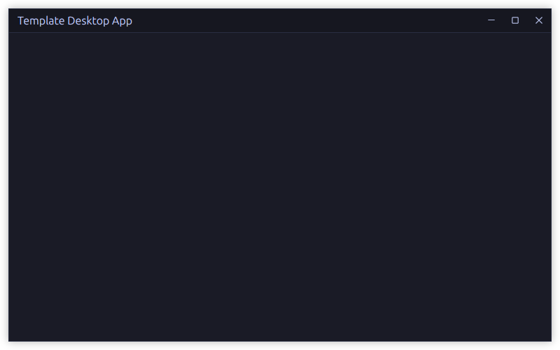

# GPUI Template

A minimal desktop app template built with GPUI and GPUI Component.



> ## Prerequisites
>
> - rustup, with the stable Rust toolchain installed
> - Git
> - Windows, macOS, or Linux
> - OS-native build tools required by Rust desktop applications
>
> Install rustup from <https://rustup.rs/>.

> ## Setup
>
> ```bash
> git clone https://github.com/TonyMarkham/gpui-template.git
> cd gpui-template
> ```

> ## Submodules
>
> The `submodules/` directory is kept in this repository for easy source reference only. The app depends on the published crates from crates.io and should not use the submodules as Cargo dependencies.
>
> To fetch the reference source:
>
> ```bash
> git submodule update --init --recursive
> ```

> ## Run
>
> ```bash
> cargo run
> ```

> ## Check
>
> ```bash
> cargo check
> ```
